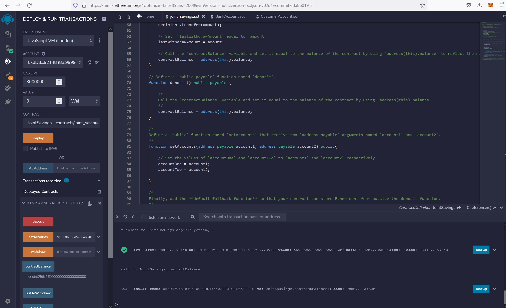

# hw20-solidity

Use the setAccounts function as requested and/or did not share a screenshot of the execution in the repo's README.md.

Test the deposit function and/or did not share screenshots of the execution of three transactions in the repo's README.md.

Test the withdrawal functionality and/or did not share screenshots of the execution of two transactions, as well as the terminal output from the lastToWithdraw and lastWithdrawAmount functions in the repo's README.md.

